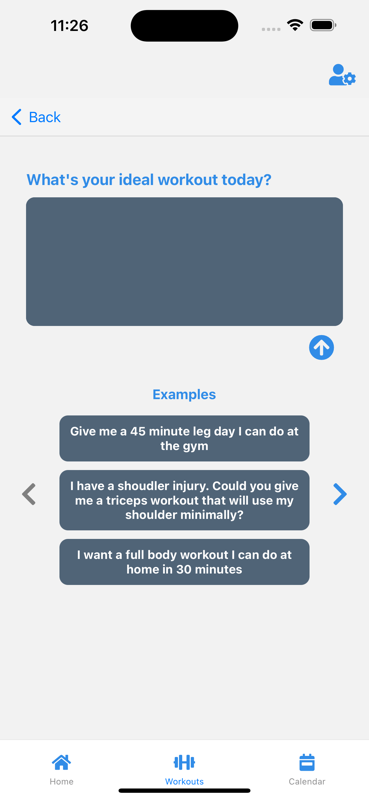
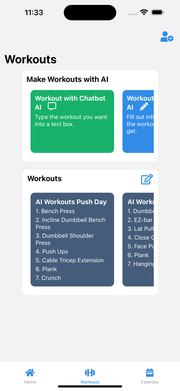
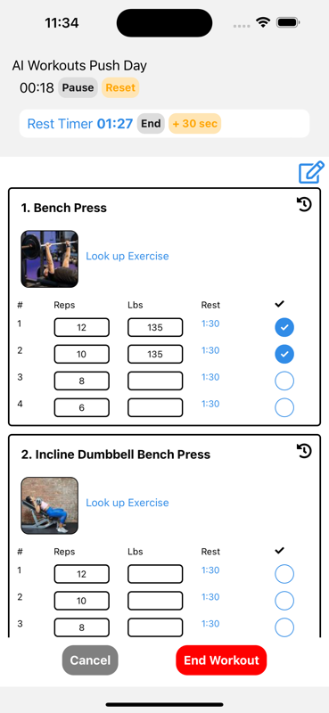
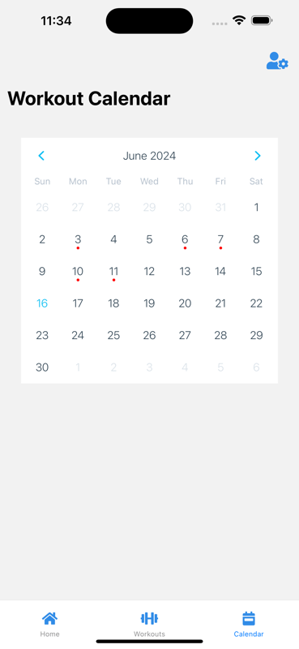
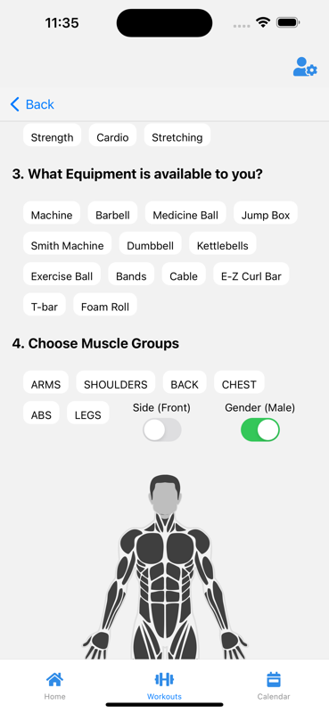

> 📦 **Archive** — This is an archive of screenshots and documentation for the AI Workouts app.
>
> **Tools Used:** ChatGPT API, Xcode, React Native, React, Google Ads, Python, AWS Lambda, DynamoDB, AWS API Gateway

---

# 🏋️ AI Workouts

Experience the future of fitness with our AI-powered workout app! Get personalized workout plans tailored to your goals, enjoy real-time tracking during your sessions, and revisit your progress anytime. Let AI be your virtual trainer and achieve your fitness dreams effortlessly.

This app is your one-stop shop for creating and tracking your workouts. You can track lifts, cardio, and more! Our system gives a lot of creative power to our users.

---

## ✨ Key Features

- **Create UNLIMITED workout plans** - Build as many custom routines as you need
- **AI-powered workout generation** - Let artificial intelligence create personalized plans for your goals
- **Custom workout plans** - YOU get to set the measures and define what you track
- **Track anything** - Reps, sets, pounds, kilograms, miles, minutes, and more!
- **Built-in timer** - Track your exercise duration during workout sessions
- **Flexible editing** - Add/remove sets, add/remove exercises, rename workouts, reorder exercises
- **Freestyle workouts** - Start empty and add tracking information on the fly
- **Progress history** - View data from past workouts anytime

---

## 📸 App Screenshots

### Home & Workout Management

### Workout Planning

### Exercise Tracking

### Progress Visualization

### Session Details

## 💡 Use Cases

- **Strength Training**: Track your lifts with custom weight and rep counts
- **Cardio**: Monitor distance, time, and pace for running or cycling
- **HIIT Workouts**: Time your intervals with the built-in timer
- **Custom Metrics**: Track any metric you can think of that matters to you

---

## 🤖 AI-Powered Personalization

Our intelligent system learns from your preferences and goals to generate workout plans that match your fitness level and objectives. Whether you're a beginner or an advanced athlete, AI Workouts adapts to your needs.
